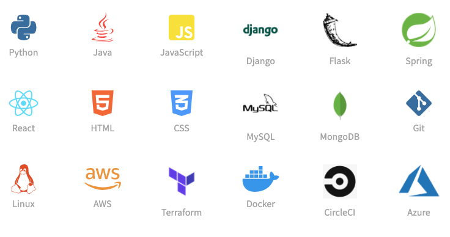

### Hi there 👋


<!--
### About Me

```Java
public class AboutMe{
    public static void main(String[] args) {
        Human Jing = new JingYang("Jing Yang", "Computer Software Engineering");
        Jing.run();
    }
}
class Human {
    protected String name, major;

    public Human(String name, String major) {
        this.name = name;
        this.major = major;
    }
    public void run() {
        System.out.println("Hello!");
    }
}
class JingYang extends Human {
    private Object[] hobbies = new String[]{"hiking", "yoga", "Scifi"};
    public JingYang(String name, String major) {
        super(name, major);
    }
    public void run() {
        System.out.println(String.format("Hello, my name is %s.\nI study %s in Northeastern University.",this.name, this.major));
        System.out.println(String.format("I like %s, %s, and %s.",this.hobbies));
    }
}
```

### Skills



-->

<!--
**jingyang97/jingyang97** is a ✨ _special_ ✨ repository because its `README.md` (this file) appears on your GitHub profile.

- 🔭 I’m currently working on ...
- 🌱 I’m currently learning ...
- 👯 I’m looking to collaborate on ...
- 🤔 I’m looking for help with ...
- 💬 Ask me about ...
- 📫 How to reach me: ...
- 😄 Pronouns: ...
- ⚡ Fun fact: ...
-->
